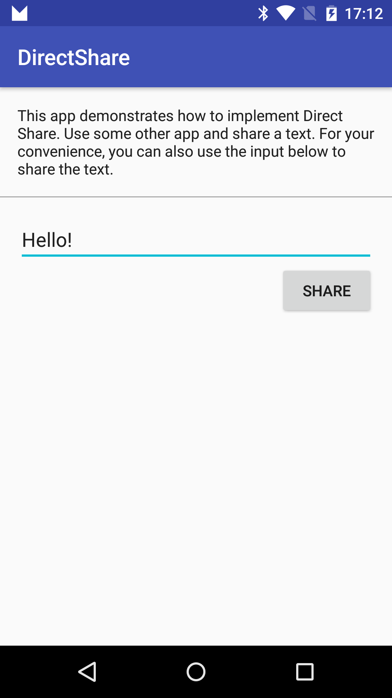
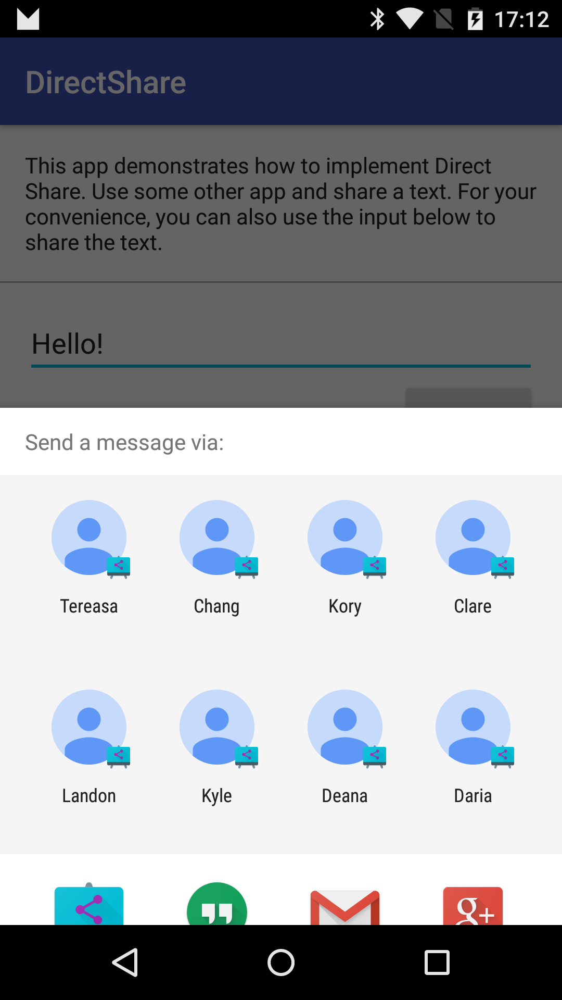
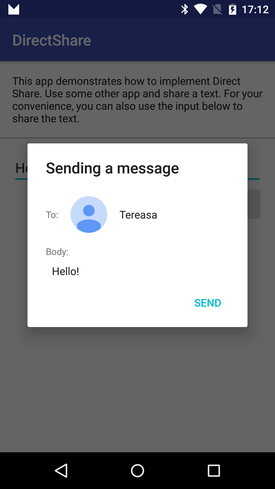

Android DirectShare Sample
===================================

Sample demonstrating how to show some options directly in the list of share intent candidates.

Introduction
------------

[Direct Share][1] is a feature that allows apps to show their internal options directly in the
system Intent chooser dialog. This sample is a dummy messaging app, and just like any other
messaging apps, it receives intents for sharing a plain text. When a user shares some text from some
other app, this sample app will be listed as an option. Using the Direct Share feature, this app
also shows some of contacts directly in the chooser dialog.

To enable Direct Share, apps need to implement a Service extending
[ChooserTargetService][2]. Override the method [onGetChooserTargets][3] and return a list of Direct
Share options.

In your AndroidManifest.xml, add a meta-data tag in your Activity that receives the Intent. Specify
android:name as android.service.chooser.chooser_target_service, and point the android:value to the
Service.

[1]: https://developer.android.com/reference/android/service/chooser/package-summary.html
[2]: https://developer.android.com/reference/android/service/chooser/ChooserTargetService.html
[3]: https://developer.android.com/reference/android/service/chooser/ChooserTargetService.html#onGetChooserTargets(android.content.ComponentName%2C%20android.content.IntentFilter)

Pre-requisites
--------------

- Android SDK 27
- Android Build Tools v27.0.2
- Android Support Repository

Screenshots
-------------

   

Getting Started
---------------

This sample uses the Gradle build system. To build this project, use the
"gradlew build" command or use "Import Project" in Android Studio.

Support
-------

- Google+ Community: https://plus.google.com/communities/105153134372062985968
- Stack Overflow: http://stackoverflow.com/questions/tagged/android

If you've found an error in this sample, please file an issue:
https://github.com/googlesamples/android-DirectShare

Patches are encouraged, and may be submitted by forking this project and
submitting a pull request through GitHub. Please see CONTRIBUTING.md for more details.

License
-------

Copyright 2017 The Android Open Source Project, Inc.

Licensed to the Apache Software Foundation (ASF) under one or more contributor
license agreements.  See the NOTICE file distributed with this work for
additional information regarding copyright ownership.  The ASF licenses this
file to you under the Apache License, Version 2.0 (the "License"); you may not
use this file except in compliance with the License.  You may obtain a copy of
the License at

http://www.apache.org/licenses/LICENSE-2.0

Unless required by applicable law or agreed to in writing, software
distributed under the License is distributed on an "AS IS" BASIS, WITHOUT
WARRANTIES OR CONDITIONS OF ANY KIND, either express or implied.  See the
License for the specific language governing permissions and limitations under
the License.
